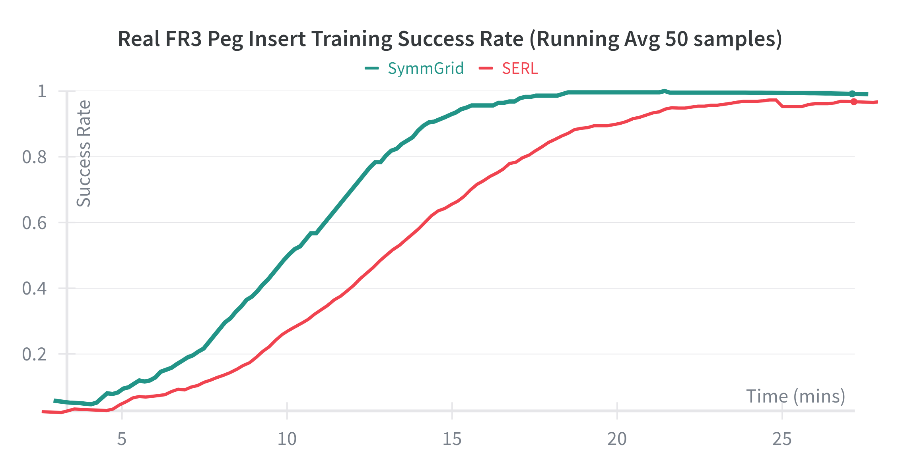
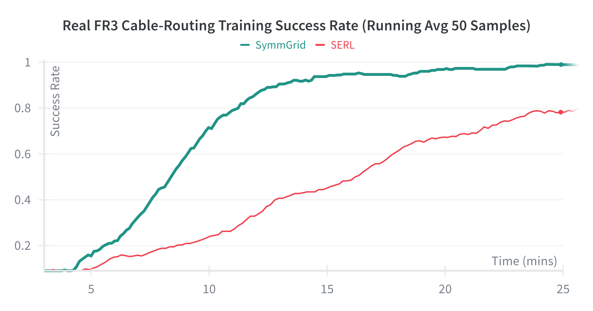
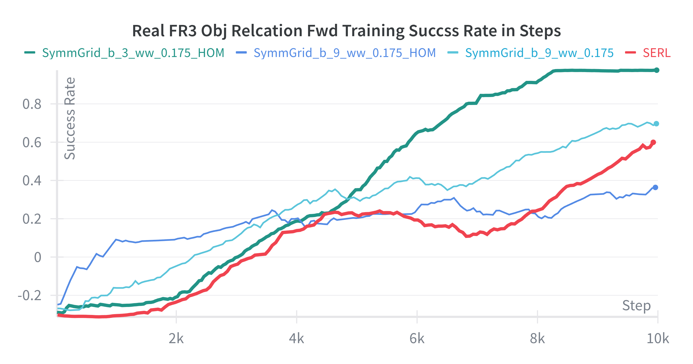

# FractalSerl — Fractal Symmetries for Sample-Efficient Robotic Learning

[](https://discord.com/invite/bAxjvvJzNM)
[](https://lipscomb-robotics.notion.site/?source=copy_link)
[](https://www.frontiersin.org/journals/robotics-and-ai/articles/10.3389/frobt.2026.1791812/abstract)
[](https://www.instagram.com/lippyrobotics/)
[](https://www.youtube.com/@lippyRoboticsLab)
[](https://opensource.org/licenses/MIT)


Short description
-----------------

FractalSERL implements Branched Euclidean Group Fractal Symmetries — a trajectory-level augmentation framework that accelerates policy learning by iteratively applying affine and Euclidean-group transformations to episodic trajectories. Treating an episodic MDP as a tree of state–action pairs, self-similar branching produces fractal symmetry expansions that populate replay buffers with diverse, consistent experiences. We demonstrate improvements on simulated and real Franka manipulation tasks, achieving robust policies in as little as 14 minutes (avg. ~20 minutes) of wall-clock training.

Contributions in this repo include:
- **Fractal SERL Framework**: A preliminary research implementation of fractal symmetry for deep reinforcement learning, demonstrating how branched symmetries accelerate DRL policy learning in physical robots.
- **SymmGrid**: Efficient robot data generation through trajectory-level parallelized symmetric transformations that significantly speed up policy learning while improving performance and consistency on physical hardware.
- **Fractal Symmetry Replay Buffer**: An Optimized Datastore and Replay Buffer implementation designed to support parallelized computations and image handling without excessive memory overhead, enabling faster training iterations.
- **nAUC Performance Metric**: Using normalized Area under the Curve (nAUC) as a trajectory-wide performance metric to capture combined contributions of sample efficiency and policy performance throughout training.
- **Homographies**: for image warping during sample-time for fixed global cameras when undergoing symmetrical transformations.

<p align="center">
  
  
  
</p>

Navigation
----------

The `docs/` folder contains additional Markdown files with step-by-step guides. Quick links are provided below:

- [Overview of code structure](docs/overview.md)
- [Installation guide](docs/installation.md)
- [Run in simulation](docs/run_sim.md)
- [Run on the real robot](docs/run_realrobot.md)


Quick start (very short)
------------------------

1. Install dependencies: see `docs/installation.md`.
2. Run a demo in sim: see `docs/run_sim.md` for instructions to launch `franka_sim`
3. For real hardware, follow the instructions in `docs/run_realrobot.md` and configure the files related to `serl_robot_infra/`.

Citation
--------

If you use FractalSERL in your research, please cite our paper:

```bibtex
@misc{everett2026symmGrid,
      title={SymmGrid: Super-Scaling On-Robot Learning with Parallelized Symmetries and Egocentric–Exocentric Visual Perception.},
      author={Gabe Everett, Brice Gunter, Ryan Vander Stelt, Cleiver Ruiz-Martinez, Blake Hull and Juan Rojas },
      year={2026},
      eprint={2607.26985},
      archivePrefix={arXiv},
      primaryClass={cs.RO}
      }

@article{vanderstelt2026SymmGrid,
    author={Vander Stelt, Ryan  and Ruiz-Martinez, Cleiver I. and Rosen, Caeden  and Hull, Blake  and Rojas, Juan },
    title={Exploring deep reinforcement learning acceleration by superscaling data augmentation via branched fractal symmetries},
    journal={Frontiers in Robotics and AI},
    volume={Volume 13 - 2026},
    year={2026},
    url={https://www.frontiersin.org/journals/robotics-and-ai/articles/10.3389/frobt.2026.1791812},
    doi={10.3389/frobt.2026.1791812},
    issn={2296-9144},
}
```
